# Salut, moi c'est RYBZ

---

### À propos

- Étudiant en **BUT MMI** (Métiers du Multimédia et de l'Internet)
- Je construis des sites et des web apps, du design jusqu'à la mise en ligne
- En ce moment : **DEICIDE**, un jeu de plateforme vertical pour borne d'arcade
- Je fais aussi de la vidéo sur YouTube

### Stack

  

  
  

### Projets

| Projet | Description |
|---|---|
| **[Portfolio](https://mathysribes.fr)** | Site one-page bilingue, React + TypeScript + Tailwind, API YouTube en Node/Express |
| **[DEICIDE](https://github.com/bdarties/arcade/tree/main/games/2026/deicide)** | Plateformer vertical en Phaser, thème ombre et lumière, joué sur une borne d'arcade |

### Activité

